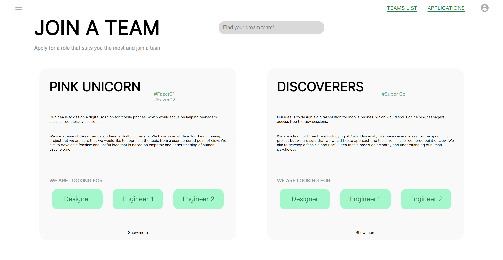
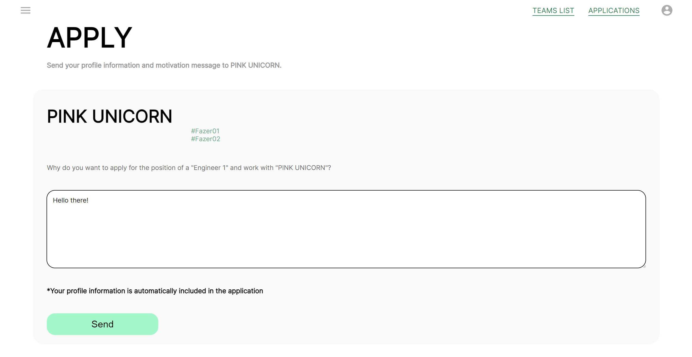
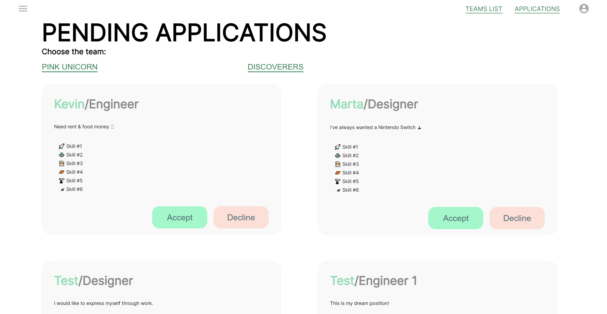
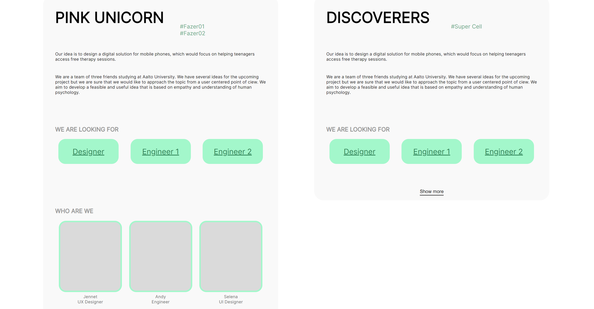

# Coding assignment (x.04.2023)




## Description
An assignment created in about 10 hours of work. Planned as a support tool at hackathons and conventions to help people organize and look for teams.
## Project setup

To run this project, use following commands:

```
$ npm run party // starts the server
$ npm start
```

Thank you for checking it out!